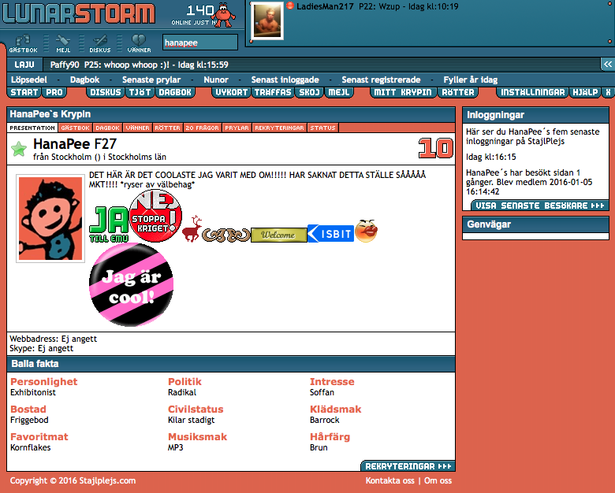

I have a tendency to indulge in nostalgia perhaps a bit more than some would consider normal.
But i figured I could improve my web development skills at the same time it would be easier to justify it.. to my self..

So Im planing on taking websites that i enjoyed and have a very fond memory of from my youth and recreate them using modern web technologies.

## First up, lunarstorm

lunarstorm was a socialnetwork in sweden most active in the early 2000s. I wasnt that active on it but I did have an account.
I remember playing robotwars on a flash site and chatting to people on lunarstorm, _good times_.

I do think the aestetichs for lack of better word still has something,


Pretty slick right ?

This site used table for layout and images for the rest, as was the standard back then, but the web has improved alot since then, so maybe we can do better. lets give it a shot.

First i need to start by getting basic stuff like the main colors.

- main orange: #d76447
- darkest blue #1d5370
- lightest blue #316181
- highlight blue #658da1
- white: #FFF

lets start with that and add more when we find it.

Im not making a totally new project for this but this can live under my projects folder in this blog.

### Basic elements

lets start with a basic element like the link
we can see on the screenshot above that padding wasnt a thing back then, and that there is a posibility of a radius on each corner

lets make a Link component that we can reuse for all of the cases.

```javascript
insert link sourcecode

```
